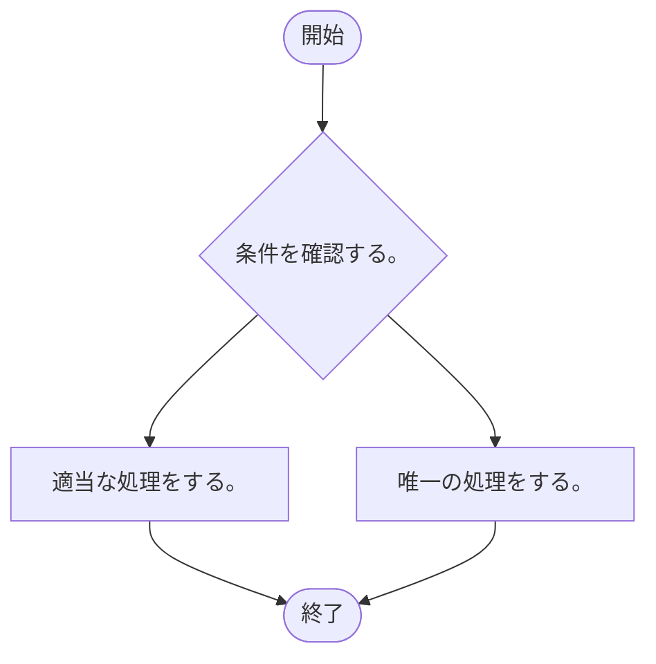

# Empressia Flow Note

* [概要](#概要)
* [使い方](#使い方)
	* [試してみる](#試してみる)
	* [Gradleから実行する](#Gradleから実行する)
	* [Javaのプログラム内で実行する](#Javaのプログラム内で実行する)
	
* [ライブラリの依存関係](#ライブラリの依存関係)
* [ライセンス](#ライセンス)
* [制限事項](#制限事項)
* [解析できない？](#解析できない？)

## 概要

Empressia Flow Noteは、  
Javaのソースコード上にかかれたFlowNote用のコメントから、フローチャートの生成を支援します。  

実際に実行されるコードを1個ずつフローチャートにするのではなく、コメントをベースに生成していきます。  
これにより、より概念的なフローチャートを自動生成することを目指します。  

ソースコードに対するフローチャートを自動で再構成できることで、  
変更を確認しやすくなるなどの効果が得られると考えています。  

基本的なプロセスと分岐、メソッド呼び出しの自動解決をサポートしています。  

以下のように、Javaのソースコードから、Mermaid形式のMarkdownを生成することができます。  

Sampleのソースコード。  

```java
public class Sample {
	public static void sample01() {
		// Flow: 唯一の処理をする。
	}
	public void sample02() {
		boolean condition = true;
		// Flow: 条件を確認する。
		if(condition) {
			// Flow: 適当な処理をする。
		} else {
			sample01();
		}
	}
}
```

Sample.sample02のフローチャート。  



## 使い方

簡単な実行と、設定による調整の他に、  
ライブラリとしてのカスタマイズも想定しています。  

### 試してみる

このリポジトリで、GradleのcreateFlowchartタスクを実行することで、生成を試すことができます。  
実行には、JDK 21以上が必要です。  

> graldew createFlowchart

Visual Studio Codeの実行からも生成を試すことができます。  

生成結果は、『doc/』ディレクトリに出力されます。  

### Gradleから実行する

mainのソースコード領域を汚さずに、実行するために、  
build.gradleに、toolソースセットなどを用意して、実行タスクを定義します。  

```groovy
sourceSets {
	tool {
	}
}

dependencies {
	// 最新バージョンは、別途、確認ください。
	// カスタマイズするときは、tooltoolImplementationとします。
	toolRuntimeOnly("jp.empressia:jp.empressia.flownote:1.0.0");
}

tasks.register("createFlowchart", JavaExec) {
	classpath = sourceSets.tool.runtimeClasspath + sourceSets.main.runtimeClasspath;
	mainClass = "jp.empressia.flownote.Main";
	args(
		"-s", "src/main/java/",
		"-o", "doc/flowchart/Flowchart_{2}_{3}.md"
	);
}
```

定義したGradleのタスクを実行します。  

> gradlew createFlowchart

引数なしで実行することでヘルプが表示されます。  

### Javaのプログラム内で実行する

FlowNote.Parser.Builderを作成して、任意の設定を追加します。  
build、parseを経て、analayzeメソッドを呼び出すことで出力します。  
MermaidMarkdownWriterを使用することで、Mardkdown用にMermaid形式で出力します。  

```java
FlowNote.create(
	Parser.Builder.create(
		SupportUtilities.generateSourceRootPaths(FlowNote.DEFALUT_SOURCE_ROOT_PATH),
		SupportUtilities.generateReferencePaths()
	).build()
).parse().analyzeAll(new MermaidMarkdownWriter("doc/flowchart/Flowchart_{2}_{3}.md"));
```

各クラスを継承するなどして調整できます。  

[Gradleから実行する](#Gradleから実行する)例とともに使用することで、カスタマイズした形で実行できます。  

## ライブラリの依存関係

以下のライブラリを使用しています。  

JavaParser

> https://github.com/javaparser/javaparser

picocli

> https://picocli.info/

## ライセンス

いつも通りのライセンスです。  
zlibライセンス、MITライセンスでも利用できます。  

ただし、チーム（複数人）で使用するときは、MITライセンスとしてください。  

## 制限事項

*	switch文での分岐はサポートされていません。  
	必要ならば、分岐の手前で分岐全体の説明ノードを構成すれば良いと考えています。  

*	for文やwhile文などのループはサポートされていません。  
	breakやcontinueによる分岐はサポートされていません。  
	必要ならば、ループの手前でループ全体の説明ノードを構成すれば良いと考えています。  
	ループの前後にノードを構成して、表現をカスタマイズすることでループは表現できるかもしれません。  

*	catchの中に書かれたノードもそのまま構成されます。  
	catchの中にノードを書くこと自体がないと考えています。  

*	returnによる戻るサポートは、分岐の中で、直接書かれたときだけサポートされます。  
	また、returnの厳密な位置の確認は行われません。  
	例えば、tryやcatchの中でのreturnは無視されます。  

*	インターフェースや抽象クラスなどによる、未実装なメソッドの呼び出しは、  
	実装が一意に特定できるときに限り、自動で解決されます。  

## 解析できない？

いくつかのケースで、メソッド呼び出しが解析できないことがあります。  

多くは、クラスパスの不足で、自動的に読み飛ばされますが、  
警告やエラーとしてメッセージが出力されることがあります。  

警告は、現象が確認されているもの。  
エラーは、現象が確認されていないものです。  

原則、該当するメソッドの呼び出し先が、反映されないということになります。  
呼び出し先にノードがなければ、問題にはならないかと思います。  

詳細を確認したいときは、ShowResolutionFailureDetailsを有効にして実行してください。  
以下のように、スタックトレースが表示されるようになります。  

スタックトレースのサンプル。  

```
java.lang.NullPointerException: Cannot invoke "com.github.javaparser.resolution.types.ResolvedType.isReferenceType()" because "rightType" is null
        at com.github.javaparser.symbolsolver.javaparsermodel.JavaParserFacade.getBinaryTypeConcrete(JavaParserFacade.java:526)
        at com.github.javaparser.symbolsolver.javaparsermodel.TypeExtractor.visit(TypeExtractor.java:139)
        at com.github.javaparser.symbolsolver.javaparsermodel.TypeExtractor.visit(TypeExtractor.java:64)
        at com.github.javaparser.ast.expr.BinaryExpr.accept(BinaryExpr.java:140)
        at com.github.javaparser.symbolsolver.javaparsermodel.JavaParserFacade.getTypeConcrete(JavaParserFacade.java:563)
        at com.github.javaparser.symbolsolver.javaparsermodel.JavaParserFacade.getType(JavaParserFacade.java:424)
        at com.github.javaparser.symbolsolver.javaparsermodel.JavaParserFacade.solveArguments(JavaParserFacade.java:303)
        at com.github.javaparser.symbolsolver.javaparsermodel.JavaParserFacade.solve(JavaParserFacade.java:323)
        at com.github.javaparser.symbolsolver.javaparsermodel.JavaParserFacade.solve(JavaParserFacade.java:134)
        at com.github.javaparser.symbolsolver.JavaSymbolSolver.resolveDeclaration(JavaSymbolSolver.java:190)
        at com.github.javaparser.ast.expr.MethodCallExpr.resolve(MethodCallExpr.java:332)
```
